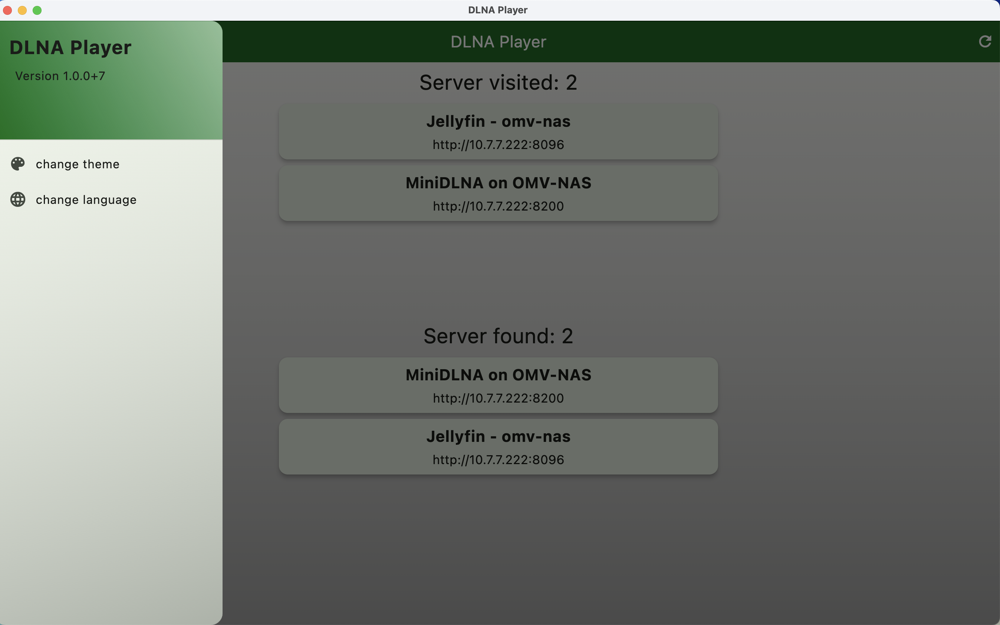
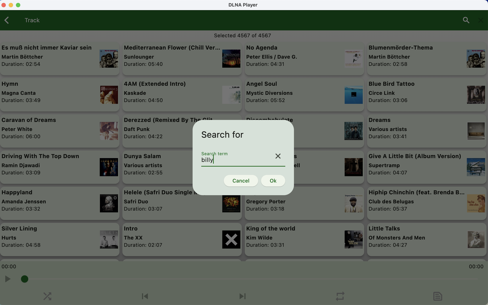
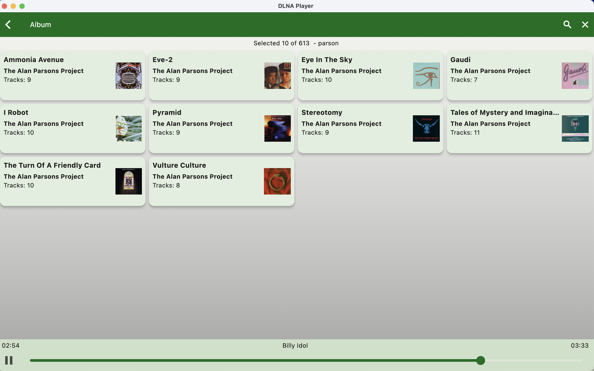

# dlna_player

A DLNA ([Digital Living Network Alliance](https://en.wikipedia.org/wiki/Digital_Living_Network_Alliance)) music player made with Flutter.

## Overview

The idea for this app came through the lack of a simple DLNA player for linux. Nevertheless, 
this app works on Windows, macOS, iOS and Android as well.

This app has been tested so far with MiniDLNA and Jellyfin. Both DLNA server were installed 
on an OpenMediaVault NAS server. MiniDLNA was installed direct while Jellyfin was running in a
Docker container.

The displayed categories depend on the used DLNA server. That's why the categories are
different on the screenshots. The installed DLNA server were using German, so some texts are
in German even though the app language was set to English.

The implemented search functionality is not searching on the server. Instead, the
received lists (tracks, artists, albums etc.) are searched/filtered on the client.

## Features

- Dart 3 and Flutter 3.27 compatible
- several themes (Material 3)
- two player widget sizes (click on player title to change)
- localization (English and German)
- works on Android, iOS, Linux, MacOS and Windows
- lyrics (via genius.com - see also below: Build release version)
- search artist via web links on Discogs, Musicbrainz and Wikipedia 

## Screenshots
### MacOS

    
    
    
    
    
    
    
    
    

### Android

    
    
    

    
    
    

    
    

## Acknowledgements
This project would be impossible without the following packages:

[upnp2](https://pub.dev/packages/upnp2) and [audioplayers](https://pub.dev/packages/audioplayers) do the heavy lifting
of handling the UPNP protocol and playing audio files. The handling of the media keys is done
by [hid_listener](https://github.com/localcc/hid_listener).

## Tips and tricks
### Update logo etc.

When the logo has been changed, run the following command

    > flutter pub run icons_launcher:create

to recreate all logo images for all platforms.

### Localization

The app uses the `Intl` package to maintain different localizations. Run the following command, if you change
the content of the `./lib/l10n/*.arb` files:

    > flutter gen-l10n

This will update the files in `.dart_tool/flutter_gen/gen_l10n`.

> **Info**
>
> This command is also necessary, when the app is built for the first time.
 
### Build release version
The access of the genius api at api.genius.com needs a token. Therefore, you have to supply
this token when you compile your own version:

    > flutter build macos --dart-define="GENIUS_TOKEN=YOUR-OWN-TOKEN"

