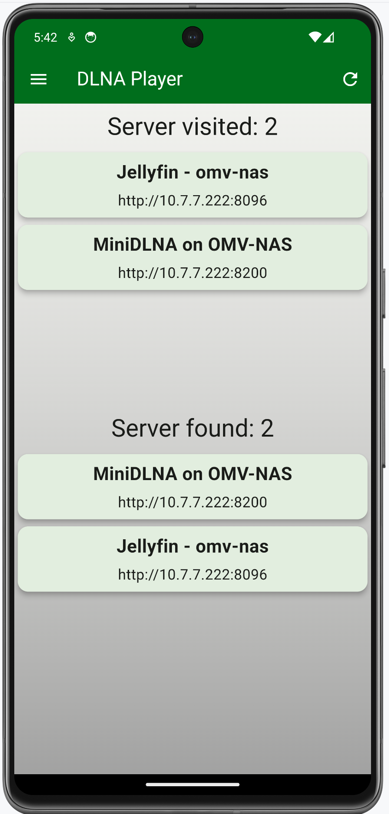
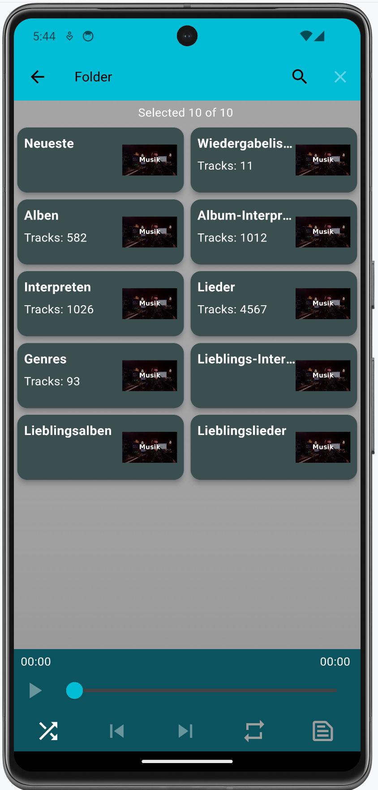
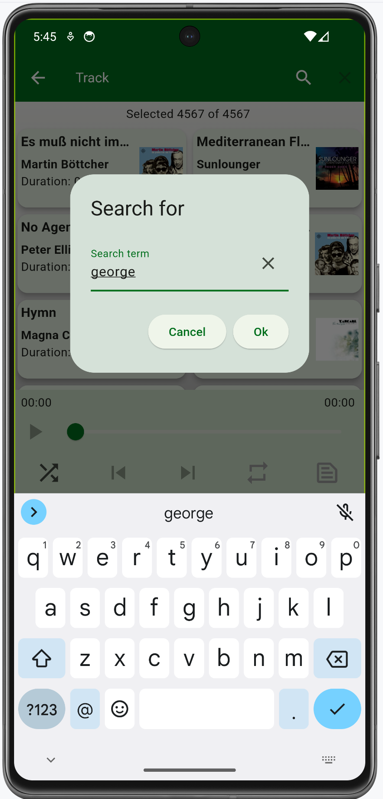

# dlna_player

A DLNA ([Digital Living Network Alliance](https://en.wikipedia.org/wiki/Digital_Living_Network_Alliance)) music player made with Flutter.

## Overview

The idea for this app came through the lack of a simple DLNA player for linux. Nevertheless, 
this app works on Windows, macOS, iOS and Android as well.

This app has been tested so far with MiniDLNA and Jellyfin. Both DLNA server were installed 
on an OpenMediaVault NAS server. MiniDLNA was installed direct while Jellyfin was running in a
Docker container.

The displayed categories depend on the used DLNA server. That's why the categories are
different on the screenshots. The installed DLNA server were using German, so some texts are
in German even though the app language was set to English.

The implemented search functionality is not searching on the server. Instead, the
received lists (tracks, artists, albums etc.) are searched/filtered on the client.

## Features

- Dart 3 and Flutter 3.27 compatible
- several themes (Material 3)
- two player widget sizes (click on player title to change)
- localization (English and German)
- works on Android, iOS, Linux, MacOS and Windows
- lyrics (via genius.com)
- search artist via web links on Discogs, Musicbrainz and Wikipedia 

## Screenshots
### MacOS

    
    
    
    
    
    
    
    
    

### Android

    
    
    

    
    
    

    
    

## Acknowledgements
This project would be impossible without the following packages:

[upnp2](https://pub.dev/packages/upnp2) and [audioplayers](https://pub.dev/packages/audioplayers) do the heavy lifting
of handling the UPNP protocol and playing audio files. The handling of the media keys is done
by [hid_listener](https://github.com/localcc/hid_listener).

## Tips and tricks
### Update logo etc.

When the logo has been changed, run the following command

    > flutter pub run icons_launcher:create

to recreate all logo images for all platforms.

### Localization

The app uses the `Intl` package to maintain different localizations. Run the following command, if you change
the content of the `./lib/l10n/*.arb` files:

    > flutter gen-l10n

This will update the files in `.dart_tool/flutter_gen/gen_l10n`.

> **Info**
>
> This command is also necessary, when the app is built for the first time.
 
### Genius lyrics
The access of the genius api at api.genius.com needs a token. Therefore, you have to supply
this token in the settings dialog that's available via the 3 dot menu in the upper right corner.

## Build Linux Flatpak
### General
We need a special Docker image for building the app and the flatpak version of it. It's best to use the oldest
supported Linux OS for this task, to get the widest OS support for our flatpak app. I'm using the LTS version
Ubuntu 20.04. The [Dockerfile](./flatpak/Dockerfile) takes this as the base image and installs then all the needed dependencies
to be able to compile the source code for Linux. In additon, the flatpak utilities are also installed. It's also
important to install all the dependencies, that the Linux version of the used Flutter packages needs. You find
this information typically on pub.dev at the Linux version of the used package.

The build time for this image is approx. 10 minutes on my machine and the resulting image size is around 12GB.

### Image for Flutter and Flatpak
Build the image:

    cd flatpak
    docker build --platform linux/amd64 -t flutterpack:1.0.0 . 

### Build and pack
Execute the following command in the project root folder to compile the Flutter source code and to generate
a flatpak version of it (`de.luedtke.shoppinglist.flatpak`):

    docker run --rm --privileged --platform linux/amd64 -u builder -v "$PWD":/home/builder/app \
        -w /home/builder/app/flatpak flutterpack:1.0.0 "./build-flutter-app.sh"

### Local install
In order to run the flatpak app, you need to have the following runtime installed on your local machine:

    flatpak install org.freedesktop.Platform/x86_64/23.08

Now install the app locally:

    flatpak install --user de.luedtke.dlna_player.flatpak

If you want to remove it:

    flatpak remove de.luedtke.dlna_player
